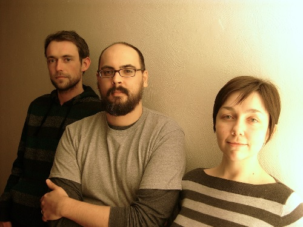

# Dusklight Trio 

In the last month, Trevor, Allison, and I have been hard at work on a
new project, [Dusklight Trio](http://dusklighttrio.com). Just
yesterday, we released a new digital album entitled, ["The Blue Hour
Sessions"](http://dusklighttrio.bandcamp.com).  It is available for
free (or pay what you want) on bandcamp.  You can also find a page
about it on this site.

Check it out!

It is instrumental piano trio music with sounds rooted in jazz,
classical, and rock.  

We are all excited to start playing some shows in
and around Pittsburgh.

It is a bit of a departure from the dense proggy Eighth Whale sound.
The music is a bit more open with room for dynamics. The songs have
strong "sing-able" melodies (in spite of being instrumental).

Speaking of Eighth Whale, we have been getting a little bit of
coverage amongst a few prog websites and blogs. It is always a joy to
find that someone half-way across the planet is digging something you
worked on.
