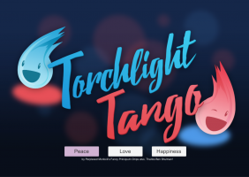
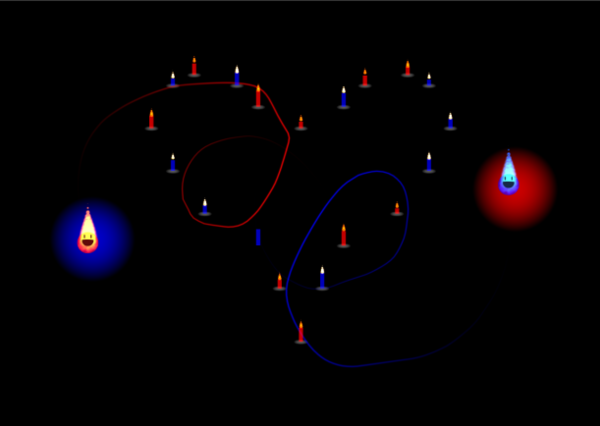

# Global Game Jam 2016 - Torchlight Tango

## About the Game Jam

This weekend I took part in the global game jam.  In case you aren’t familiar with the lingo, the global game jam [website[(http://globalgamejam.org/about) describes itself thusly:

> The Global Game Jam® (GGJ) is the world’s largest game jam event (game creation) taking place around the world at physical locations. Think of it as a hackathon focused on game development. It is the growth of an idea that in today’s heavily connected world, we could come together, be creative, share experiences and express ourselves in a multitude of ways using video games – it is very universal. The weekend stirs a global creative buzz in games, while at the same time exploring the process of development, be it programming, iterative design, narrative exploration or artistic expression. It is all condensed into a 48 hour development cycle. The GGJ encourages people with all kinds of backgrounds to participate and contribute to this global spread of game development and creativity.
>  
> The structure of a jam is usually that everyone gathers on Friday late afternoon, watches a short video keynote with advice from leading game developers, and then a secret theme is announced. All sites worldwide are then challenged to make games based on that same theme, with games to be completed by Sunday afternoon. In January 2015, we had over 500 locations in 78 countries create 5439 games in one weekend! GGJ 2016 is January 29-31 at a location near you… if not you can make one of your own. The jam is known for helping foster new friendships, increase confidence and opportunities within the community. The jam is always an intellectual challenge. People are invited to explore new technology tools, trying on new roles in development and testing their skills to do something that requires them to design, develop create, test and make a new game in the time span of 48 hours.  > > The GGJ stimulates collaboration and is not a competition.

## Torchlight Tango

We had a team of five people working on a game. The team’s name was 
“Perplexed Morlock’s Fancy Principum Chips”.  We had to come up with
a name when we took a team photo, so we each chose a random word and
stuck them together.

I originally had planned on using a handmade 2d game engine (mostly
a thin wrapper around SDL). It’s probably a good thing I didn’t
considering it’s buggy and kind of half-baked. We made use of the 
Unity game engine to make the game, which I personally didn’t have 
any experience in.

GGJ 2016’s theme was “ritual”. We came up with a game called
Torchlight Tango.  It is a two player cooperative game (although 
it works with one player as well).

*Download:* 

You can find a link to the executable at the bottom of that page.

The left and right sticks each control different flames.  One flame is
red and the other is blue.  The object of the game is to have each of
the flames light the similarly colored candles on the screen.  As you
light candles, more appear on the screen.  If you don’t move quickly
the existing candles will burn out.  Around each flame is a
“spotlight” of the opposite color of the flame.  If the red player
moves right, the similarly colored spotlight around the blue flame
will move left until the edge of the spotlight hits the
flame. Movement is confined within the area of the spotlight.  The
effect is that if both players move in the same direction, they will
get stuck. This forces the two players to coordinate with each other
so they can get where they need to go. Once you finish lighting the
candles, your score is based on the number candles that are still lit.

My role on the team was mostly that of a musician.  The event started
Friday evening, which I was unable to attend most of.  Saturday
morning, I lugged my giant desktop computer along with a midi
keyboard, and some microphones to the game jam site.  The team I was
on caught me up on the details of the game and I worked on a song to
use in the main game-play.  I was going for a lighthearted, but upbeat
song to fit the low-stress contemplative feeling of the game.  I spent
most of the afternoon recording the song. I think it came out well.
It has a catchy laid-back melody with a luscious big sounding
arrangement of synth and orchestral sounds.  There is a quick moving
synth bass that complements that melody.

I also did a small amount of work creating a few sound effects for the
game.  I had two sounds “success” sounds I made when a player lights a
candle. I made them by programming a synth.  The sound effect is a
chord that is played in the key of the game’s background music which
makes the effect very pleasant. I also attempted to program a synth
sound for the candle going out.  After spending a long time failing to
come up with something good, I stuck a microphone in front of Ben.  He
made a “tsssss” sound in one take, and in half a minute we had a
finished sound effect.

I then spent some time fumbling around Unity and eventually with the
help of my teammates I got music and sound effects into the game along
with a crash course in how unity generally works.

I was then tasked with making two new short pieces of music, one for
the title screen and another for the completion of a level.  I made a
quick synth-driven upbeat funk song to match the cheery playfulness of
the title screen art that was so graciously donated to us by a member
of another team.

Then on completion of each level, we needed victory music. I was
really happy how this turned out. It really gives off a celebratory
vibe.

I shoved the remaining music in the game and then moved onto game
development.  I was much less useful in this regard compared to other
team members due to my inexperience with Unity, but I helped out where
I could with small additions, bug fixes, and testing.

We worked late into the next morning and went home around 4am with a
very close to complete game.  We came back later in the morning
tired-eyed and sleepy-tailed to place the finishing touches on the
game before we demoed it in the showcase. We rush fixed several bugs
at the last minute which was somewhat nerve racking.

The showcase was a lot of fun. We got to walk around the room and find
out what all the other teams had been working on all weekend. That
room was certainly filled to the brim with talent and creativity.  It
was also neat to observe how people reacted to the game we created.

You can play games created at the location I was at
[here](http://globalgamejam.org/2016/jam-sites/pittsburgh-igda-etc). Or
if you want to browse games that were uploaded globally, you can find
that [here](http://globalgamejam.org/2016/games).

I hope to do more game development in the future. GGJ was a really fun
experience.

