# Music 

## Discography

### Diversion - Jesse Spillane

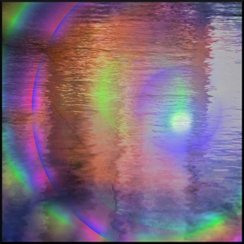

<iframe style="border: 0; width: 100%; height: 42px;" src="https://bandcamp.com/EmbeddedPlayer/album=2021974421/size=small/bgcol=ffffff/linkcol=0687f5/transparent=true/" seamless><a href="https://jessespillane.bandcamp.com/album/diversion">Diversion by Jesse Spillane</a></iframe>

Title
  : Diversion
  
Artist
  : Jesse Spillane
  
Download
  : [bandcamp](https://jessespillane.bandcamp.com/album/diversion), [itunes](https://music.apple.com/us/album/diversion/1561516984), [amazon](https://www.amazon.com/Diversion-Jesse-Spillane/dp/B091NDG1ZS)

Stream
  : [spotify](https://open.spotify.com/album/7xuW2rMBOh4zmXm32xW79a), [apple music](https://music.apple.com/us/album/diversion/1561516984), [amazon](https://www.amazon.com/dp/B091NDG1ZS/), [deezer](https://www.deezer.com/us/album/220136252), [youtube music](https://music.youtube.com/playlist?list=OLAK5uy_ks6yfPdfkr69uZ7-fAoXsZ8qbHJwqCEQw)

Date
  : March 2021
  
License
  : [cc-by](https://creativecommons.org/licenses/by/4.0/)

Description
  : Made mostly of songs I made for FAWM 2021 (February Album Writing Month)

### Theme for Another Time - Jesse Spillane

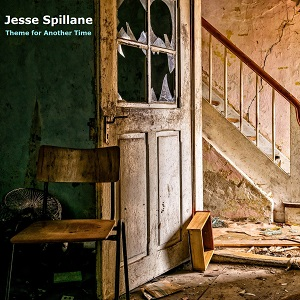

<iframe style="border: 0; width: 100%; height: 42px;" src="https://bandcamp.com/EmbeddedPlayer/album=1361944553/size=small/bgcol=ffffff/linkcol=0687f5/transparent=true/" seamless><a href="https://jessespillane.bandcamp.com/album/theme-for-another-time">Theme for Another Time by Jesse Spillane</a></iframe>

Title
  : Theme for Another Time
  
Artist
  : Jesse Spillane
  
Download
  : [bandcamp](https://jessespillane.bandcamp.com/album/theme-for-another-time), [itunes](https://music.apple.com/us/album/theme-for-another-time/1531079603?uo=4&app=itunes&at=1001lry3&ct=dashboard), [amazon](http://www.amazon.com/gp/product/B08HQK4PYX)
  
Stream
  : [spotify](https://open.spotify.com/album/6mVGwGEOlHdB4FueV7ip18), [apple music](https://music.apple.com/us/album/theme-for-another-time/1531079603?uo=4), [amazon](http://www.amazon.com/gp/product/B08HQK4PYX), [deezer](https://www.deezer.com/album/172199612), [youtube music](https://music.youtube.com/playlist?list=OLAK5uy_mPg515wQ_MmQfW8V23DaGmrP6nHCXSgX0)

Date
  : Sept 2020
  
License
  : [cc-by](https://creativecommons.org/licenses/by/4.0/)

Description
  : n/a

### Mobile Songs Vol 2 - Jesse Spillane

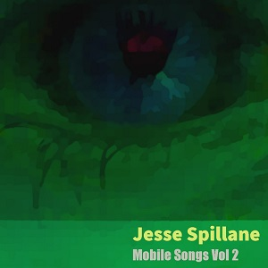

<iframe style="border: 0; width: 100%; height: 42px;" src="https://bandcamp.com/EmbeddedPlayer/album=192608479/size=small/bgcol=ffffff/linkcol=0687f5/transparent=true/" seamless><a href="https://jessespillane.bandcamp.com/album/mobile-songs-vol-2">Mobile Songs Vol 2 by Jesse Spillane</a></iframe>

Title
  : Mobile Songs Vol 2
  
Artist
  : Jesse Spillane
  
Download
  : [bandcamp](https://jessespillane.bandcamp.com/album/mobile-songs-vol-2), [archive.org](https://archive.org/details/mobilesongsvol2) ( [flac](https://archive.org/compress/mobilesongsvol2/formats=24BIT%20FLAC&file=/mobilesongsvol2.zip), [mp3](https://archive.org/compress/mobilesongsvol2/formats=VBR%20MP3&file=/mobilesongsvol2.zip)), [itunes](https://music.apple.com/us/album/mobile-songs-vol-2/1542688411), [amazon](https://www.amazon.com/dp/B08PCD42HC/)

  
Stream
  : [m3u](https://archive.org/download/mobilesongsvol2/mobilesongsvol2_vbr.m3u), [spotify](https://open.spotify.com/album/2A507rI7EZ9qZm27GnaCdM), [apple music](https://music.apple.com/us/album/mobile-songs-vol-2/1542688411), [amazon](https://www.amazon.com/dp/B08PCD42HC/), [deezer](https://www.deezer.com/us/album/189953272), [youtube music](https://music.youtube.com/playlist?list=OLAK5uy_mw1SqeCVp27AbYCeol2Amsh6kRf17Ggvs)

Date
  : Sept 2019
  
License
  : [cc-by](https://creativecommons.org/licenses/by/4.0/)

Description
  : Songs made on my cellphone with Caustic 3

### Mobile Songs Vol 1 - Jesse Spillane

<iframe style="border: 0; width: 100%; height: 42px;" src="https://bandcamp.com/EmbeddedPlayer/album=445789157/size=small/bgcol=ffffff/linkcol=0687f5/transparent=true/" seamless><a href="https://jessespillane.bandcamp.com/album/mobile-songs-vol-1">Mobile Songs Vol 1 by Jesse Spillane</a></iframe>

Title
  : Mobile Songs Vol 1
  
Artist
  : Jesse Spillane
  
Download
  : [bandcamp](https://jessespillane.bandcamp.com/album/mobile-songs-vol-1), [archive.org](https://archive.org/details/JesseSpillane-MobileSongsVol1) ([flac](https://archive.org/compress/JesseSpillane-MobileSongsVol1/formats=FLAC&file=/JesseSpillane-MobileSongsVol1.zip), [mp3](https://archive.org/compress/JesseSpillane-MobileSongsVol1/formats=VBR%20MP3&file=/JesseSpillane-MobileSongsVol1.zip), [ogg](https://archive.org/compress/JesseSpillane-MobileSongsVol1/formats=OGG%20VORBIS&file=/JesseSpillane-MobileSongsVol1.zip)), [itunes](https://music.apple.com/us/album/mobile-songs-vol-1/1542299876), [amazon](https://www.amazon.com/dp/B08P6WCKSN/)
  
Stream
  : [m3u](https://archive.org/download/JesseSpillane-MobileSongsVol1/JesseSpillane-MobileSongsVol1_vbr.m3u), [spotify](https://open.spotify.com/album/3vczhHqwAVS7rJgpUUNFoW), [apple music](https://music.apple.com/us/album/mobile-songs-vol-1/1542299876), [amazon](https://www.amazon.com/dp/B08P6WCKSN/), [deezer](https://www.deezer.com/us/album/189226272), [youtube music](https://music.youtube.com/playlist?list=OLAK5uy_leyUf_UjaLdVd78yFhmi5Iwg3xud0cRzk)

Date
  : March 2019
  
License
  : [cc-by](https://creativecommons.org/licenses/by/4.0/)

Description
  : Songs made on my cellphone with Caustic 3

### The Laundry Cycle - Jesse Spillane

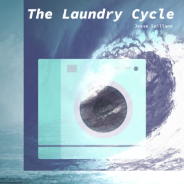

<iframe style="border: 0; width: 100%; height: 42px;" src="https://bandcamp.com/EmbeddedPlayer/album=701688153/size=small/bgcol=ffffff/linkcol=0687f5/transparent=true/" seamless><a href="https://jessespillane.bandcamp.com/album/the-laundry-cycle">The Laundry Cycle by Jesse Spillane</a></iframe>

Title
  : The Laundry Cycle
  
Artist
  : Jesse Spillane
  
Download
  : [bandcamp](https://jessespillane.bandcamp.com/album/the-laundry-cycle), [archive.org](https://archive.org/details/JesseSpillane-TheLaundryCycle) ([flac](https://archive.org/compress/JesseSpillane-TheLaundryCycle/formats=FLAC&file=/JesseSpillane-TheLaundryCycle.zip), [mp3](https://archive.org/compress/JesseSpillane-TheLaundryCycle/formats=VBR%20MP3&file=/JesseSpillane-TheLaundryCycle.zip), [ogg](https://archive.org/compress/JesseSpillane-TheLaundryCycle/formats=OGG%20VORBIS&file=/JesseSpillane-TheLaundryCycle.zip)), [itunes](https://music.apple.com/us/album/the-laundry-cycle/1542295845), [amazon](https://www.amazon.com/dp/B08P6VL2RW/)

Stream
  : [m3u](https://archive.org/download/JesseSpillane-TheLaundryCycle/JesseSpillane-TheLaundryCycle_vbr.m3u), [spotify](https://open.spotify.com/album/2zapjBjuMjYOLz6kzFsMnm), [apple music](https://music.apple.com/us/album/the-laundry-cycle/1542295845), [amazon](https://www.amazon.com/dp/B08P6VL2RW/), [deezer](https://www.deezer.com/us/album/189220262), [youtube music](https://music.youtube.com/playlist?list=OLAK5uy_nX_q31wboEU5fryt4ny3AQbQ_ke1PADR0)

Date
  : March 2018
  
License
  : [cc-by](https://creativecommons.org/licenses/by/4.0/)

Description
  : n/a

### The Maddening Parade - Jesse Spillane

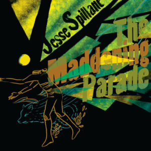

<iframe style="border: 0; width: 100%; height: 42px;" src="https://bandcamp.com/EmbeddedPlayer/album=1913176468/size=small/bgcol=ffffff/linkcol=0687f5/transparent=true/" seamless><a href="https://jessespillane.bandcamp.com/album/the-maddening-parade">The Maddening Parade by Jesse Spillane</a></iframe>

Title
  : The Maddening Parade
  
Artist
  : Jesse Spillane
  
Download
  : [bandcamp](https://jessespillane.bandcamp.com/album/the-maddening-parade), [archive.org](https://archive.org/details/JesseSpillane-TheMaddeningParade) ([flac](https://archive.org/compress/JesseSpillane-TheMaddeningParade/formats=FLAC&file=/JesseSpillane-TheMaddeningParade.zip), [mp3](https://archive.org/compress/JesseSpillane-TheMaddeningParade/formats=VBR%20MP3&file=/JesseSpillane-TheMaddeningParade.zip), [ogg](https://archive.org/compress/JesseSpillane-TheMaddeningParade/formats=OGG%20VORBIS&file=/JesseSpillane-TheMaddeningParade.zip)), [itunes](https://music.apple.com/us/album/the-maddening-parade/1542407529), [amazon](https://www.amazon.com/dp/B08P7XWWZL/)
  
Stream
  : [m3u](https://archive.org/download/JesseSpillane-TheMaddeningParade/JesseSpillane-TheMaddeningParade_vbr.m3u), [spotify](https://open.spotify.com/album/2Gz1vbOhQWVdkeF56zNWcb), [apple music](https://music.apple.com/us/album/the-maddening-parade/1542407529), [amazon](https://www.amazon.com/dp/B08P7XWWZL/), [deezer](https://www.deezer.com/us/album/189375372), [youtube music](https://music.youtube.com/playlist?list=OLAK5uy_kxUkfTGYSiHWYtWIXWX2lqQh_zw3Fqlz8)
  
Date
  : December 2015
  
License
  : [cc-by](https://creativecommons.org/licenses/by/4.0/)

Description

  : Jesse Spillane - Piano, Keyboard, Synth, Bass, Guitar, Programming (all tracks)
  : Jon Wolff - Guitar on 'Dum Dum Conumdrum' - jwolffrecording.wordpress.com
  : Trevor Richards - Mastering, Guitar on 'Sun Dried' - trevorrichardsmusic.com
  : Cynthia Lee - Album Art

### Sky Ship - Jesse Spillane

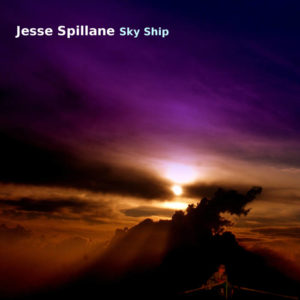

<iframe style="border: 0; width: 100%; height: 42px;" src="https://bandcamp.com/EmbeddedPlayer/album=2505500720/size=small/bgcol=ffffff/linkcol=0687f5/transparent=true/" seamless><a href="https://jessespillane.bandcamp.com/album/sky-ship">Sky Ship by Jesse Spillane</a></iframe>

Title
  : Sky Ship
  
Artist
  : Jesse Spillane
  
Download
  : [bandcamp](https://jessespillane.bandcamp.com/album/sky-ship), [archive.org](https://archive.org/details/SkyShip)([flac](https://archive.org/compress/SkyShip/formats=FLAC&file=/SkyShip.zip), [mp3](https://archive.org/compress/SkyShip/formats=VBR%20MP3&file=/SkyShip.zip), [ogg](https://archive.org/compress/SkyShip/formats=OGG%20VORBIS&file=/SkyShip.zip)), [itunes](https://music.apple.com/us/album/sky-ship/1542380205), [amazon](https://www.amazon.com/dp/B08P7TGQB2/)
  
Stream
  : [m3u](https://archive.org/download/SkyShip/SkyShip_vbr.m3u), [spotify](https://open.spotify.com/album/0uOmhNyI9EUF3vn3kKa5WR), [apple music](https://music.apple.com/us/album/sky-ship/1542380205), [amazon](https://www.amazon.com/dp/B08P7TGQB2/), [deezer](https://www.deezer.com/us/album/189341312), [youtube music](https://music.youtube.com/playlist?list=OLAK5uy_mv5VRprvoiYgfN54HPI8RX9CiWLw5zf1o)
  
Date
  : April 2015
  
License
  : [cc-by](https://creativecommons.org/licenses/by/4.0/)

Description
  : Songs created between 2010 and 2014
  

### The Blue Hour Sessions - Dusklight Trio

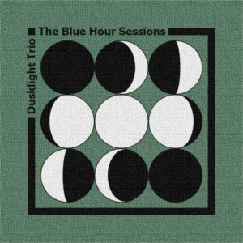

<iframe style="border: 0; width: 100%; height: 42px;" src="https://bandcamp.com/EmbeddedPlayer/album=1717679961/size=small/bgcol=ffffff/linkcol=0687f5/transparent=true/" seamless><a href="https://dusklighttrio.bandcamp.com/album/the-blue-hour-sessions">The Blue Hour Sessions by Dusklight Trio</a></iframe>

Title
  : Blue Hour Sessions
  
Artist
  : Dusklight Trio
  
Download
  : [bandcamp](http://dusklighttrio.bandcamp.com/album/the-blue-hour-sessions)
  
Date
  : February 2015
  
License
  : Standard

Description
  : The first and only release of piano, bass, drums trio, Dusklight Trio

### Live at Howlers - Eighth Whale

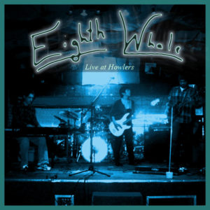

<iframe style="border: 0; width: 100%; height: 42px;" src="https://bandcamp.com/EmbeddedPlayer/album=3261411621/size=small/bgcol=ffffff/linkcol=0687f5/transparent=true/" seamless><a href="https://eighthwhale.bandcamp.com/album/live-at-howlers">Live at Howlers by Eighth Whale</a></iframe>

Title
  : Live at Howlers
  
Artist
  : Eighth Whale
  
Download
  : [bandcamp](https://eighthwhale.bandcamp.com/album/live-at-howlers)
  
Date
  : October 2014 (recorded December 2010)
  
License
  : Standard

Description
  : Live December 2010 recordings at Howlers in Pittsburgh. There are a few videos for these recordings as well ([Peanut Butter Suprise](https://www.youtube.com/watch?v=TfuXdkK0azE) and [Awesome Sauce](https://www.youtube.com/watch?v=5G5S1iNi8_8))

### Eighth Whale - Eighth Whale

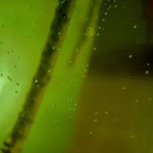

<iframe style="border: 0; width: 100%; height: 42px;" src="https://bandcamp.com/EmbeddedPlayer/album=2191927561/size=small/bgcol=ffffff/linkcol=0687f5/transparent=true/" seamless><a href="https://eighthwhale.bandcamp.com/album/eighth-whale">Eighth Whale by Eighth Whale</a></iframe>

Title
  : Eighth Whale
  
Artist
  : Eighth Whale
  
Download
  : [bandcamp](https://eighthwhale.bandcamp.com/album/eighth-whale)
  
Date
  : September 2014
  
License
  : Standard

Description
  : The self titled second release by Eighth Whale.
  

### Art of Presentation - Jesse Spillane

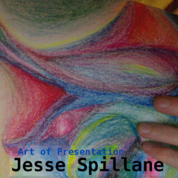

<iframe style="border: 0; width: 100%; height: 42px;" src="https://bandcamp.com/EmbeddedPlayer/album=37258741/size=small/bgcol=ffffff/linkcol=0687f5/transparent=true/" seamless><a href="https://jessespillane.bandcamp.com/album/art-of-presentation">Art of Presentation by Jesse Spillane</a></iframe>

Title
  : Art of Presentation
  
Artist
  : Jesse Spillane
  
Download
  : [bandcamp](https://jessespillane.bandcamp.com/album/art-of-presentation), [archive.org](https://archive.org/details/JesseSpillane-ArtOfPresentation) ([flac](https://archive.org/compress/JesseSpillane-ArtOfPresentation/formats=FLAC&file=/JesseSpillane-ArtOfPresentation.zip), [mp3](https://archive.org/compress/JesseSpillane-ArtOfPresentation/formats=VBR%20MP3&file=/JesseSpillane-ArtOfPresentation.zip), [ogg](https://archive.org/compress/JesseSpillane-ArtOfPresentation/formats=OGG%20VORBIS&file=/JesseSpillane-ArtOfPresentation.zip)), [itunes](https://music.apple.com/us/album/art-of-presentation/1543043599), [amazon](https://www.amazon.com/dp/B08PHGFB88)

Stream
  : [m3u](https://archive.org/download/JesseSpillane-ArtOfPresentation/JesseSpillane-ArtOfPresentation_vbr.m3u), [spotify](https://open.spotify.com/album/4xQPFW46O9q14x3HL9l8pm), [apple music](https://music.apple.com/us/album/art-of-presentation/1543043599), [amazon](https://www.amazon.com/dp/B08PHGFB88), [deezer](https://www.deezer.com/us/album/190462352), [youtube music](https://music.youtube.com/playlist?list=OLAK5uy_lEoSXwfpruMwnK95x2roHKp_mZFFnvIrE)

Date
  : May 2010
  
License
  : [cc-by](https://creativecommons.org/licenses/by/4.0/)

Description
  : microphone-comparison-freight-train-wav sample by mab
  www.freesound.org/samplesViewSingle.php?id=22953

### Basement EP - Eighth Whale

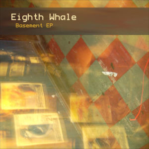

<iframe style="border: 0; width: 100%; height: 42px;" src="https://bandcamp.com/EmbeddedPlayer/album=3083176487/size=small/bgcol=ffffff/linkcol=0687f5/transparent=true/" seamless><a href="https://eighthwhale.bandcamp.com/album/basement-ep">Basement EP by Eighth Whale</a></iframe>

Title
  : Basement EP
  
Artist
  : Eighth Whale
  
Download
  : [bandcamp](https://eighthwhale.bandcamp.com/album/basement-ep)
  
Date
  : February 2010
  
License
  : Standard

Description

  : Debut EP by Eighth Whale. Recorded in a basement if that wasn't clear.

### Descent of the Goober Monster - Jesse Spillane 

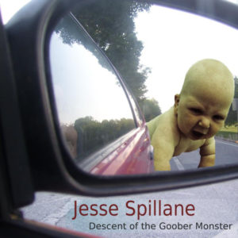

<iframe style="border: 0; width: 100%; height: 42px;" src="https://bandcamp.com/EmbeddedPlayer/album=66366282/size=small/bgcol=ffffff/linkcol=0687f5/transparent=true/" seamless><a href="https://jessespillane.bandcamp.com/album/descent-of-the-goober-monster">Descent of the Goober Monster by Jesse Spillane</a></iframe>

Title
  : Descent of the Goober Monster
  
Artist
  : Jesse Spillane
  
Download
  : [bandcamp](https://jessespillane.bandcamp.com/album/descent-of-the-goober-monster), [archive.org](https://archive.org/details/JesseSpillane-DescentOfTheGooberMonster)([flac](https://archive.org/compress/JesseSpillane-DescentOfTheGooberMonster/formats=FLAC&file=/JesseSpillane-DescentOfTheGooberMonster.zip), [mp3](https://archive.org/compress/JesseSpillane-DescentOfTheGooberMonster/formats=VBR%20MP3&file=/JesseSpillane-DescentOfTheGooberMonster.zip), [ogg](https://archive.org/compress/JesseSpillane-DescentOfTheGooberMonster/formats=OGG%20VORBIS&file=/JesseSpillane-DescentOfTheGooberMonster.zip)), [itunes](https://music.apple.com/us/album/descent-of-the-goober-monster/1542291834), [amazon](https://www.amazon.com/dp/B08P6ST2BF)

Stream
  : [m3u](https://archive.org/download/JesseSpillane-DescentOfTheGooberMonster/JesseSpillane-DescentOfTheGooberMonster_vbr.m3u), [spotify](https://open.spotify.com/album/43nOVspOlLBOtLDnZkUoml), [apple music](https://music.apple.com/us/album/descent-of-the-goober-monster/1542291834), [amazon](https://www.amazon.com/dp/B08P6ST2BF), [deezer](https://www.deezer.com/us/album/189214512), [youtube music](https://music.youtube.com/playlist?list=OLAK5uy_kpr-YBcz67JOvSjvw5MJ41B1Hy0asp8l0)
  
Date
  : September 2008
  
License
  : [cc-by](https://creativecommons.org/licenses/by/4.0/)

Description
  : ReadeOnly - "Walkie Talkie" sample on "New Jersey" - (freesound.org)
  : LG - "Ah ah" sample - (freesound.org) 

<!--

### Songs That Go up and Down - Jesse Spillane

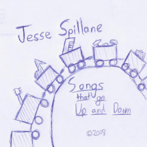

Title
  : Songs That Go Up and Down
  
Artist
  : Jesse Spillane
  
Download
  : [flac](https://archive.org/compress/JesseSpillane-SongsThatGoUpAndDown/formats=FLAC&file=/JesseSpillane-SongsThatGoUpAndDown.zip), [mp3](https://archive.org/compress/JesseSpillane-SongsThatGoUpAndDown/formats=VBR%20MP3&file=/JesseSpillane-SongsThatGoUpAndDown.zip), [ogg](https://archive.org/compress/JesseSpillane-SongsThatGoUpAndDown/formats=OGG%20VORBIS&file=/JesseSpillane-SongsThatGoUpAndDown.zip), [bandcamp](https://jessespillane.bandcamp.com/album/songs-that-go-up-and-down), [archive.org](https://archive.org/details/JesseSpillane-SongsThatGoUpAndDown)

Stream
  : [m3u](https://archive.org/download/JesseSpillane-SongsThatGoUpAndDown/JesseSpillane-SongsThatGoUpAndDown_vbr.m3u)

Date
  : January 2008
  
License
  : [cc-by](https://creativecommons.org/licenses/by/4.0/)

Description
  : This was a challenge to myself to create an album in 2 weeks during a break in college

### Techno EP - Jesse Spillane

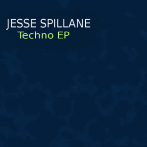

Title
  : Techno EP
  
Artist
  : Jesse Spillane
  
Download
  : [bandcamp](https://jessespillane.bandcamp.com/album/techno-ep)
  
Date
  : 2005-ish?
  
License
  : [cc-by](https://creativecommons.org/licenses/by/4.0/)

Description
  : Me messing around in FL Studio while not knowing what I was doing

-->

## Other Appearances

### (((HUM))) - Trevor Richards

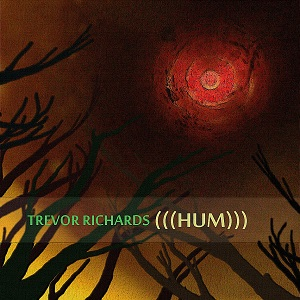

<iframe style="border: 0; width: 100%; height: 42px;" src="https://bandcamp.com/EmbeddedPlayer/album=1583627648/size=small/bgcol=ffffff/linkcol=0687f5/transparent=true/" seamless><a href="https://trevorrichards.bandcamp.com/album/hum">(((HUM))) by Trevor Richards</a></iframe>

Title
  : (((HUM)))
  
Artist
  : Trevor Richards
  
Download
  : [bandcamp](https://trevorrichards.bandcamp.com/album/hum)
  
Date
  : January 5, 2016
  
License
  : Standard

My Role
  : I play on 3 tracks on Trevor's solo record.

## Solo Music 

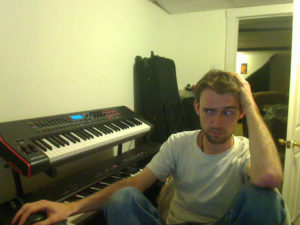

I write and record instrumental music that blends electronic, jazz,
rock, and acoustic music. All of my solo music is all released under a
creative commons [cc-by](https://creativecommons.org/licenses/by/4.0/)
license which allows for use of my music in other work provided you
give adequate attribution.

You can find all my solo albums on this site, or at
[bandcamp (mp3, flac, ogg, etc)](http://jessespillane.bandcamp.com).

## Eighth Whale 

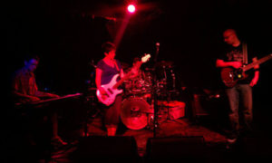

Eighth Whale was a progressive/post rock band that existed from 2009
to about 2014. Releases can be found at
[bandcamp](http://eighthwhale.bandcamp.com)

### Members

  * Allison Kacmar - bass (2010-2014)
  * Aaron Mayors - bass (2009-2010)
  * Trevor Richards - guitar (2009-2014)
  * DJ Zaccari - drums (2009-2014)
  * Jesse Spillane - keyboards (2009-2014)

### Discography

  * 2014 (October) - Live at Howlers
  * 2014 (September) - Eighth Whale
  * 2010 (February) - Basement EP

## Dusklight Trio

Dusklight Trio was a short-lived piano/bass/drum group in existence
between 2014 and 2015 that released a single EP found here and never
got around to playing shows.  The music is found at
[bandcamp](https://dusklighttrio.bandcamp.com/releases).

### Members

  * Jesse Spillane (keyboard) 
  * Allison Kacmar (bass)
  * Trevor Richards (drums)

### Discography

  * 2015 (February) - The Blue Hour Sessions
